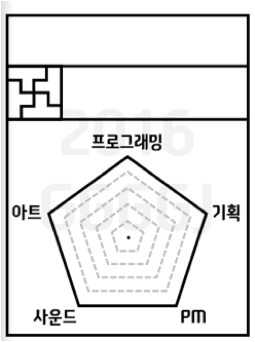

#예산안

##준비
예산은 넥슨 담당자 분으로부터 법인 카드를 받아 사용하였다. 주최자가 첫 스태프 회의 전에 판교에 방문하여 법인 카드를 미리 받아두었다.

##진행
넥슨 담당자 분을 통해 초반 예산안은 200만원(근거없음)으로 확정되었다. 이를 분배 과정에서 부족함을 느껴 100만원을 넥슨 담당자 분에게 더 요청하였고 결론적으로는 50만원을 더 지원받아 총 250만원으로 행사를 기획하였다.
행사 이전 미리 구매해두어야 하는 물품들(명찰, 도전과제 보상 및 상품 등)은 넥슨 담당자 분에게 물품 구매 링크를 보내 온라인으로 구매했다. 
사전에 물품을 체크할 필요가 있는 것은 개인 배송지로, 그럴 필요가 없는 것은 넥슨 담당자 분 쪽 배송지로 설정하였다. 
행사 시작 당일 구매해야하는 물품들(참가자 복지 등)은 행사 시작 4시간 전에 판교역에서 집합한 후 구매하였다. 크게 장보는 팀, 찜질방 티켓 구매하는 팀, 행사장 내 준비 팀으로 나뉘었으며 법인 카드는 장보는 팀과 찜질방 티켓 구매하는 팀이 돌려 썼다. 
이후 행사를 진행하면서 부족한 물품들(찜질방 티켓, 음료, 과자 등)은 추가적으로 결제하여 채워넣었다.

<table>
<tr><td>품목</td><td>예상 가격</td></tr>
<tr><td>스태프 식사비</td><td>₩150,000</td></tr>
<tr><td>도전과제 보상 및 상품</td><td>₩50,000</td></tr>
<tr><td>참가자 복지(먹을 것)</td><td>₩600,000</td></tr>
<tr><td>침가자 복지(잘 곳)</td><td>₩200,000</td></tr>
<tr><td>회의 및 진행비</td><td>₩50,000</td></tr>
<tr><td>뒷풀이</td><td>₩1,250,000</td></tr>
<tr><td>기타/예비금</td><td>₩200,000</td></tr>
</table> 

자세한 예산안 및 사용 내역은 '예산 관리' 스프레드시트를 참고.

##문제 사안
- 최종 사용 금액은 280만원으로 예산안을 초과하여, 초과한 금액은 넥슨 담당자 분이 따로 결제하였다. 
- 스태프가 사비를 써야할 일이 있었다.(택시 타기, 현금으로 결제해야하는 상황 등)

##개선 방안
- 첫 스태프 회의 전(가능하면 중간 발표회 때)에 판교에 방문하여 법인 카드를 미리 받아두기를 추천한다.
- 예산안을 초과하지 않도록 법인 카드를 사용할 때마다 예산 사용 내역 시트를 갱신하고 남은 금액을 유동적으로 관리하며 이를 관리할 스태프를 정해두면 좋을 것 같다.
- 뒷풀이 비용이 예산안을 초과하지 않도록 미리 음식점에 특정 메뉴를 주문 받지 말아달라고 이야기하면 좋을 것 같다.
- 스태프가 사비를 쓸 일이 있다는 것을 미리 알아두도록 한다.

##기타 의견
- 참가자 모집을 행사 최대 일주일 전에 마감하고 인원수 파악을 확실하게 하고 예산안을 확정하면 편할 것 같다.
- 영수증은 오프라인으로도 보관하고 사진으로도 찍어서 보관해두면 확실할 것 같다. (이후 넥슨 담당자 분에게 제출)
- 사실 뒷풀이를 가는 사람들로부터 만원씩만 걷어도 예산 초과 문제는 해결될 것 같으니 이를 고려해본다.
- 현금을 사용할 일을 만들지 않도록 한다.
- 예산안은 미래를 위해 꼭 남기기를 추천한다.

#준비물

##홍보 및 오프닝 ppt

###정의  
행사의 홍보 자리(중간 발표회)에서 사용할 홍보 ppt와 행사 당일 사용할 오프닝 ppt를 의미한다.

###진행  
주최자가 홍보 및 오프닝 ppt를 담당하여 작성하고 발표하였다.

###고려사항  
- 오프닝 ppt는 게임잼의 정의와 목적, 행사 진행 순서 및 행사 기타 안내 사항을 포함한다.
- 기타 안내 사항에서는 와이파이, 멀티탭, 음식물, 숙박 등의 내용을 자세하게 공지한다.

##참가자 명찰패

###정의  
참가자가 행사장에 입장할 때 받는 것으로 본인을 소개하는 명찰이다.

###진행  
- 95x122 사이즈로 제작하였으며 스태프와 참가자는 명찰 종이색으로 구분하였다.
- 기존에는 명찰 종이색으로 직군을 구분하였으나 1) 가독성이 떨어지는 점 2) 직군 다중 선택을 할 수 없다는 점 3) 색 별로 종이를 준비해야하기 때문에 수량 조절이 힘든 점 의 이유로 디자인을 수정하여 사용하였다. 수정된 명찰 디자인은 다음과 같다.

- 출력 및 자르기는 행사 당일 아침에 진행하였다.

###고려사항  
- 참가자 명찰패에 반드시 들어가야하는 요소(동아리소속 + 직군표시 + 이름 + 오각형 능력치)를 확정한다. 
- 넥슨 담당자분을 통해 작두를 미리 대여해 둘 것을 추천한다.

##도전과제 징표

###정의  
참가자들이 게임을 제작하는 것 이외에 부가적으로 즐길 수 있는 컨텐츠로, 특정 조건을 만족하면 해당 도전과제에 대한 징표(타이틀)를 수여한다.

###진행  
- 총 33개의 도전과제를 준비하고, 각 참가자 별로 어떤 도전과제를 달성했는지 스프레드시트로 관리하였다.
- 참가자가 도전과제를 달성하면 아크릴 명찰에 타이틀 종이를 잘라넣어 수여하였다.
- 도전과제 이미지를 미리 준비하지 않아 당일날 몇 명의 능력자 분들이 힘썼다.

###고려사항  
- 어디까지나 참가자의 선택으로 참여여부가 가능하게 해야한다. 강제성을 부여해서는 안된다.
- 개발하는 게임 내용에 대한 도전과제는 쓰지 않는다.
- 게임을 하는 것 자체에 대한 도전과제는 자제한다.

자세한 내용은 뒤에서 [240. 그 외 시스템 part](240.그-외-시스템.md)

##추첨 상품

###정의  
참가자들이 게임을 제작하는 것 이외에 부가적으로 즐길 수 있는 컨텐츠로, 도전 과제를 더 많이 달성할수록 당첨될 확률이 높아진다.

###진행  
- 넥슨 담당자분에게 넥슨 관련 게임 굿즈 후원이 가능할지 물었으나 불가능하여 예산안 내에서 추첨 상품을 물색하였다.
- 운영진에서 결정한 상품은 메이플스토리 관련 인형이었지만 상품으로 제공 할 만한 물건들을 획득하여 총 상품 개수는 8개 정도였다.

###고려사항  
- 타 회사 혹은 타 장르 굿즈를 상품으로 내걸기가 대중성 등으로 애매한 부분이 있으니 이 부분을 고려하면 좋을 것 같다.

자세한 내용은 뒤에서 [240. 그 외 시스템 part](240.그-외-시스템.md)

